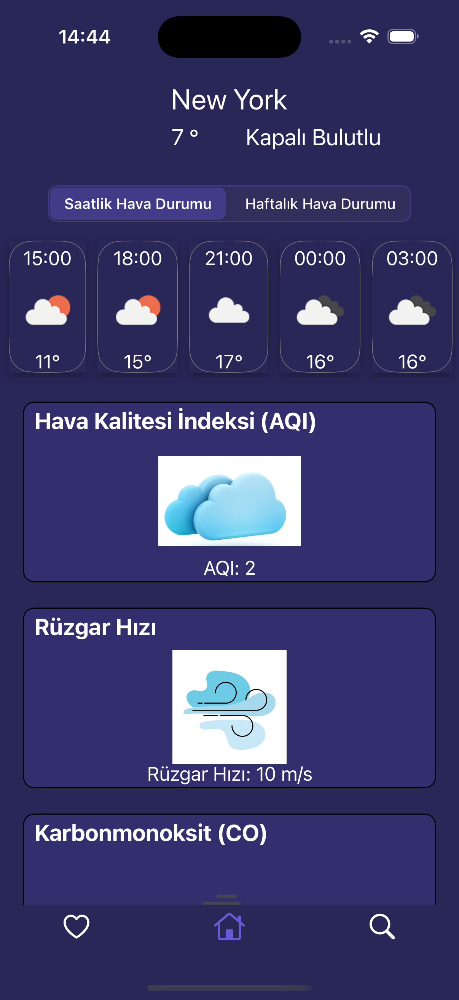
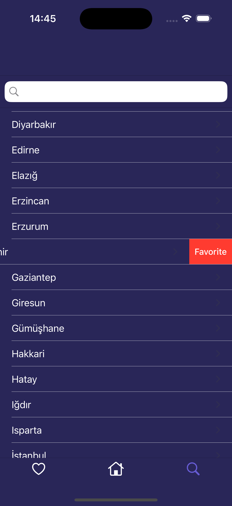
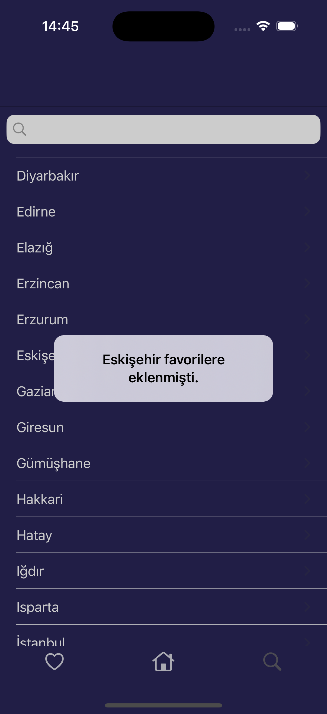

# 🌦 Hava Durumu ve Hava Kalitesi Uygulaması 

Bu iOS uygulaması, kullanıcılara günlük ve haftalık hava durumu tahmini ile hava kalitesi verilerini sunmanın yanı sıra, kişiselleştirilmiş anlık uyarılar ile önemli hava durumu değişiklikleri veya hava kalitesi uyarıları hakkında bilgi verir. Uygulama MVVM mimarisi ile geliştirilmiş olup, Restful API kullanarak güncel verileri sağlar. Ayrıca widget desteği ile ana ekrandan hızlı bilgiye erişim imkânı sunmaktadır.

# 📲 Özellikler
- **Günlük Hava Durumu**: Gün içinde saatlik hava durumu tahminlerini CollectionView içinde listeler.
- **Haftalık Hava Durumu Tahmini**: Kullanıcılar haftalık hava durumu tahminlerini görüntüleyebilir.
- **Hava Kalitesi Bilgisi**: Hava kalitesi verileri TableView içinde gösterilmektedir.
- **Kişiselleştirilmiş Anlık Uyarılar**: Hava durumu veya hava kalitesinde önemli bir değişiklik olduğunda kullanıcıları bilgilendirir.
- **Widget Desteği**: Ana ekrandan hızlıca hava durumu ve hava kalitesi bilgilerine erişim sağlar.

# 🖼 Ekran Görüntüleri

  
  
  
  

  
  
  
  

# 🚀 Teknolojiler
Projede kullanılan başlıca teknolojiler:

- **MVVM Mimarisi**: Projede katmanlı yapı ve sürdürülebilirlik için MVVM mimarisi kullanılmıştır.
- **Restful API**: OpenWeather API kullanılarak hava durumu ve hava kalitesi bilgileri alınmaktadır.
- **Kişiselleştirilmiş Bildirimler**: Kullanıcıların konumuna göre özel bildirimler ve hava durumu uyarıları gönderilir.
- **Unit Test**: Uygulamanın bazı bölümleri Unit Test ile test edilmiştir.
- **Widget Desteği**: Ana ekrandan hızlı bilgi sağlayan widget desteği içerir.
